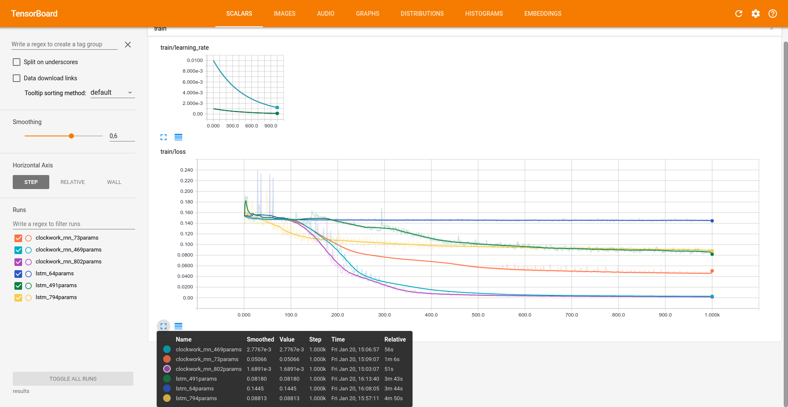
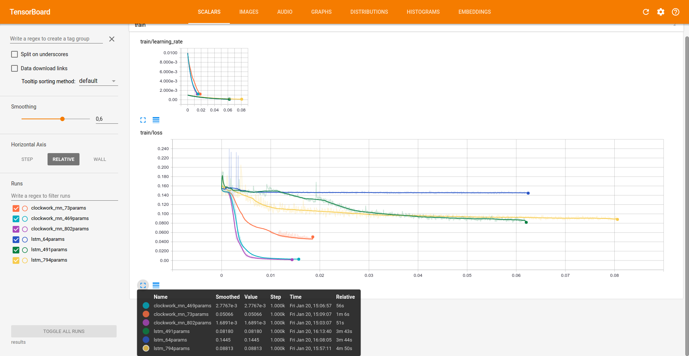
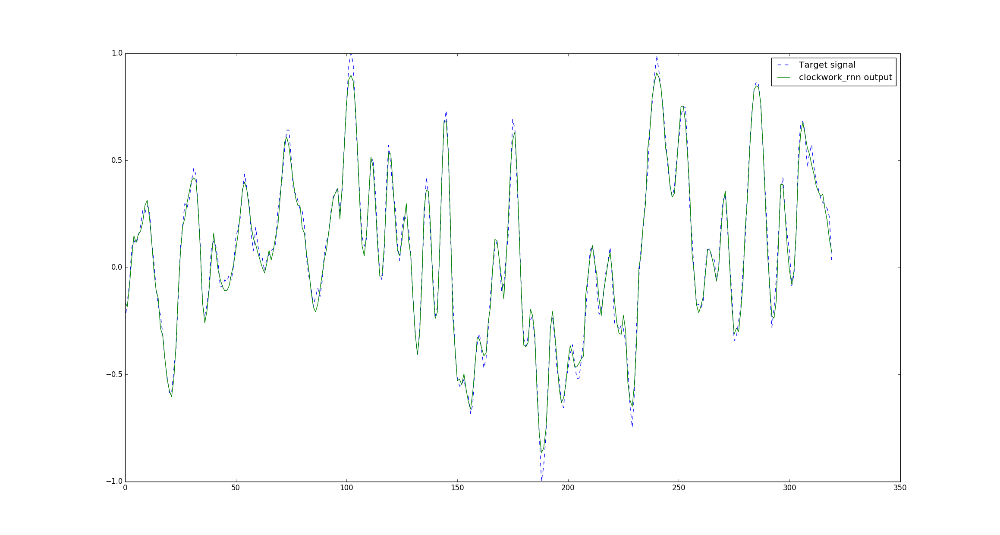

# Clockwork RNN

This project is an implementation of the Clockwork RNN
(see [paper](https://arxiv.org/abs/1402.3511)).

See [this section](#dependencies) for dependencies.

### People : Paul Mustière, Pandav2 aka David Panou
### Organization : UPMC - Master Data Science

## Clockwork-RNN

The model can be found under `models/clockwork_rnn.py`.

The current `main.py` replicates the sequence generation task
described in the paper, but the implementation should be able
to handle other tasks.

To monitor the training, you can use TensorBoard:
```
tensorboard --reload_interval 2 --logdir log
```

## Results

We ran different sizes of Clockwork RNN as well as LSTMs to compare performance
with similar numbers of parameters.

The following table summarizes the results:

| Number of parameters | Clockwork RNN (MSE) | LSTM (MSE) |
|:--------------------:|:-------------------:|:----------:|
|          ~70         |        5.0e-2       |   1.4e-1   |
|         ~480         |        2.8e-3       |   8.2e-2   |
|         ~800         |        1.7e-3       |    8.8-2   |

They were obtained with a learning rate of 0.01 for Clockwork RNN,
and 0.001 for LSTM (which was more unstable). Please beware due to hardward
constraints, those results are not average over several runs.

This table shows the dimension of the hidden state used and the resulting exact
number of parameters:

| Number of parameters | Clockwork RNN (Hidden dimension / Total parameters) | LSTM (Hidden dimension / Total parameters) |
|:--------------------:|:---------------------------------------------------:|:------------------------------------------:|
|          ~70         |                        9 / 73                       |                   3 / 64                   |
|         ~480         |                       27 / 469                      |                  10 / 491                  |
|         ~800         |                       36 / 802                      |                  13 / 794                  |

The following graph shows the MSE loss during training, scaled by epochs:



The next graph shows the same MSE loss, without the scaling by epochs.
It shows that Clockwork RNN are indeed faster to train since they require
less computations.



The following plot shows the generated signal (and the target)
for the best performing Clockwork RNN:



Generated signals for other models can be found under `results/`

## Dependencies

- NumPy
- TensorFlow (tested with 0.12.1)
- Matplotlib

For generating sequences from WAV files:

- SciPy
